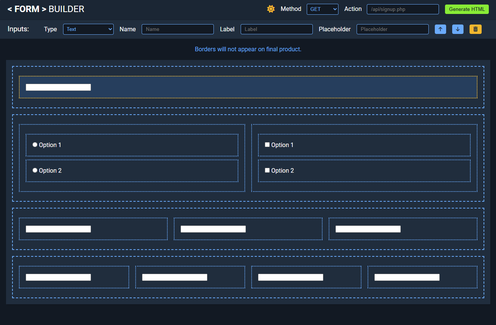
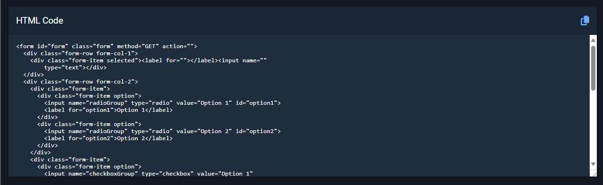
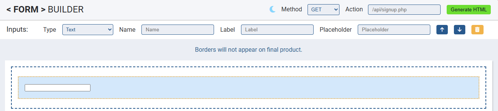
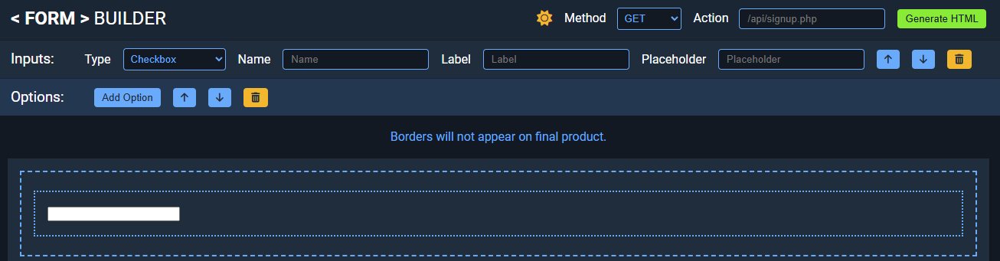

# Form Builder

A lightweight, web-based form builder that allows you to visually create HTML forms with ease. This app is built using HTML, CSS, and JavaScript, and provides a user-friendly interface to add, customize, and rearrange form elements. The generated HTML code is beautified and can be copied to your clipboard for easy integration into your projects.

## Live Demo

Check out the live app here: [Form Builder Live Demo](https://jdussold.github.io/form-builder/)

## Features

- **Visual Form Creation:** Add form rows and input groups with just a click.
- **Multiple Input Types:** Choose from text, email, password, checkboxes, radio buttons, select dropdowns, date/time inputs, file uploads, and more.
- **Live HTML Code Generation:** Generate and preview the HTML code for your form.
- **Theme Toggle:** Switch between light and dark themes.
- **Code Beautification:** The generated HTML is automatically formatted for readability.
- **Copy-to-Clipboard:** Easily copy the generated code with a single button click.
- **Uses Vite for Development:** Fast, optimized development environment.
- **Uses Tippy.js for Tooltips:** Enhances UX with better tooltip support.

## Installation and Setup

### Prerequisites

Ensure you have **Node.js** installed on your system. You can check by running:

```sh
node -v
```

If not installed, download it from [nodejs.org](https://nodejs.org/).

### Steps to Install and Run the App

1. **Clone the Repository:**

   ```sh
   git clone https://github.com/your-username/form-builder.git
   cd form-builder
   ```

2. **Install Dependencies:**

   ```sh
   npm install
   ```

3. **Run the Development Server:**

   ```sh
   npm run dev
   ```

   This will start a local development server using Vite. The app will be available at the provided local URL (e.g., `http://localhost:5173`).

4. **Build for Production (Optional):**

   ```sh
   npm run build
   ```

   This will generate optimized files in the `dist/` directory.

5. **Preview Production Build (Optional):**
   ```sh
   npm run preview
   ```
   This will serve the built files to test the production version locally.

## Usage

1. **Adding Form Elements:**

   - Click the "Add Input Group" buttons to create new form rows.
   - Use the provided options to add various input types to each row.

2. **Customizing Inputs:**

   - Click on an input element to reveal its settings.
   - Update the label, placeholder, name attribute, and input type using the sidebar options.

3. **Reordering Elements:**

   - Move elements up or down using the provided arrow buttons.

4. **Generating HTML:**

   - Click the "Generate HTML" button to create a clean, formatted version of your form's HTML.
   - Use the copy button to quickly copy the generated code to your clipboard.

5. **Theme Toggle:**
   - Click the sun/moon icon to switch between light and dark themes.

## Screenshots

- **Main Interface**

  

- **HTML Generated Code**

  

- **Light Mode Example**

  

- **Dark Mode Example**

  

## File Structure

```
form-builder/
│── index.html           # Main HTML file
│── vite.config.js       # Vite configuration file
│── package.json         # Project metadata and dependencies
│── package-lock.json    # Auto-generated dependency lock file
│── .gitignore           # Specifies files to ignore in Git
│
├── src/                 # Source files
│   ├── js/              # JavaScript logic
│   │   ├── script.js    # Main application logic
│   │   ├── components/  # Modular UI components
│   │
│   ├── css/             # Stylesheets
│   │   ├── style.css    # Main styling
│
├── public/              # Static assets
│   ├── assets/          # Images, icons, etc.
│
├── dist/                # Production-ready build files (generated after `npm run build`)
```

## Future Updates / To-Do

- **Save and Resume:** Implement functionality to save the current form state and resume building later.
- **Drag and Drop Functionality:** Upgrade the current move up/down buttons to a full drag and drop experience.
- **Live Preview Mode:** Provide a real-time preview of the form as it's being built.
- **Backend Integration:** Add support for form submission and storage with backend APIs.

## Acknowledgments

- Design inspiration by [Astro](https://www.figma.com/community/file/1157371532469023309) (CC BY 4.0).
- Uses [Vite](https://vitejs.dev/) for fast development.
- Uses [Tippy.js](https://atomiks.github.io/tippyjs/) for tooltips.
